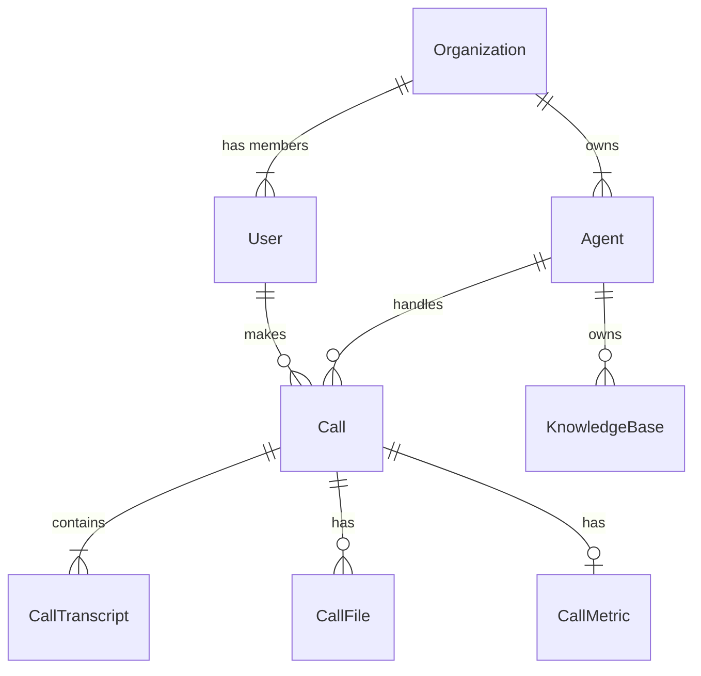

# Database Architecture & Data Flow Documentation

This document provides a comprehensive overview of the database architecture, data flow, and multi-tenant isolation used in the AI Voice Agent application.

## 1. Overview: Hybrid Database Approach

The application uses a **Virtual Hybrid Database** architecture combining two distinct types of databases:

1.  **Relational Database (SQL)**: Stores structured data like users, agents, call logs, organizations, and transcripts.
    *   **Technology**: SQLite (dev) / PostgreSQL (prod) via SQLAlchemy ORM.
    *   **Purpose**: ACID transactions, relationships, user management, history.

2.  **Vector Database**: Stores unstructured knowledge base content for AI retrieval (RAG).
    *   **Technology**: ChromaDB (local persistence).
    *   **Purpose**: Semantic search, similarity matching, context retrieval for LLM.

---

## 2. Relational Database Schema (SQL)

The SQL schema is designed for **Multi-Tenancy**, meaning multiple distinct organizations (tenants) can use the same system while their data remains isolated.

### Core Entities & Relationships



### Table Details

#### 1. Organizations (`organizations`)
The root entity for multi-tenancy.
- **id**: Unique UUID
- **name**: Organization name (e.g., "Acme Corp")
- **slug**: URL-friendly identifier

#### 2. Users (`users`)
People who log in to the dashboard.
- **organization_id**: Links user to an organization.
- **role**: `super_admin`, `org_admin`, `client`.
- **Filtering Rule**: Non-admin users can ONLY see data matching their `organization_id`.

#### 3. Agents (`agents`)
The AI voice bots configured by users.
- **organization_id**: Ensures agents belong to a specific org.
- **active_kb_id**: Links to ChromaDB collection (see Part 3).
- **sentiment_analysis_prompt**: Custom instructions for post-call analysis.
- **synthesis_voice_name**: Azure TTS voice ID.

#### 4. Calls (`calls`)
Records of every interaction.
- **agent_id**: Which agent handled the call.
- **user_id**: Who initiated the call.
- **status**: `initiated`, `ringing`, `completed`, `failed`.
- **sentiment**: Result of post-call analysis (e.g., "Interested").
- **recording_url**: Link to audio file.

#### 5. Transcripts (`call_transcripts`)
Line-by-line dialogue.
- **call_id**: Link to parent call.
- **speaker**: `user` or `agent`.
- **message**: The actual text.

---

## 3. Vector Database Structure (ChromaDB)

The Vector DB stores "Knowledge" - the documents uploaded to agents (PDFs, text files).

### Structure
- **Collections**: Each Knowledge Base (KB) gets its own **ChromaDB Collection**.
- **Naming Convention**: `kb_{kb_id}` (e.g., `kb_5587fb51-a1...`).
- **Storage**:
    - **Document**: The text chunk.
    - **Embedding**: Vector representation (1536 float array via OpenAI text-embedding-ada-002).
    - **Metadata**: `{ "kb_id": "...", "chunk_index": 5 }`.

### Linkage to SQL
The `agents` table in SQL has a column `active_kb_id` (e.g., `5587fb51...`).
- When an Agent answers a query:
    1. System looks up Agent's `active_kb_id`.
    2. System queries ChromaDB collection `kb_5587fb51...`.
    3. Retrieves relevant text chunks.

---

## 4. Data Usage & Flow

### A. Call Flow (Real-time)

1.  **Call Starts**:
    - `Call` record created in SQL with `status='initiated'`.
    - `CallMetric` initialized.

2.  **During Call (Audio Stream)**:
    - User speaks -> STT (Speech-to-Text).
    - **RAG Lookup**:
        - System grabs User Query.
        - Checks Agent's `active_kb_id`.
        - Queries ChromaDB: `search_knowledge_by_id(query, kb_id)`.
        - Returns context chunks.
    - **LLM Generation**:
        - Prompt = System Prompt + RAG Context + User Query.
        - Agent responds -> TTS (Text-to-Speech).
    - **Transcript Logging**:
        - Both User and Agent messages saved to `call_transcripts` table in SQL real-time.

3.  **Call Ends**:
    - `Call` record updated: `status='completed'`, `duration`, `recording_url` (from FreJun webhook).
    - **Sentiment Analysis Triggered**.

### B. Sentiment Analysis Flow (Post-Call)

1.  **Trigger**: `call.completed` event (via Webhook or manual).
2.  **Process**:
    - Fetch full transcript from `call_transcripts` table.
    - Fetch Agent's `sentiment_analysis_prompt` from `agents` table.
    - Send to LLM (Azure OpenAI) for analysis.
3.  **Storage**:
    - Updates `Call` record: `sentiment` (Brief) and `sentiment_details` (JSON).

---

## 5. Security & Multi-Tenancy (Filtering)

This is how we ensure User A cannot see User B's agents or calls.

### The "Organization Filter"
Every sensitive read operation is filtered by `organization_id`.

#### 1. API Level (Agents & Calls)
When a user requests `/api/agents` or `/api/calls`:
- **Admin**: Request has NO `organization_id` filter -> Returns ALL records.
- **Client**: Request includes `?organization_id=USER_ORG_ID`.
- **Backend Query**:
  ```python
  query = db.query(Agent).filter(Agent.organization_id == user_org_id)
  ```

#### 2. Vector DB Isolation
- Since each KB is a separate Chroma Collection (`kb_{id}`), data never mixes.
- An agent can only query the collection defined in its `active_kb_id`.

### Example Scenario
- **User 2** logs in (Org ID: `uuid-A`).
- **User 2** creates Agent "SalesBot" -> Saved in SQL with `organization_id='uuid-A'`.
- **User 3** logs in (Org ID: `uuid-B`).
- **User 3** lists agents -> API filters by `organization_id='uuid-B'`.
- Result: **User 3 cannot see SalesBot**.

---

## 6. How Filtering Works (Technical Implementation)

### Frontend (React)
The frontend checks the user's role:
```javascript
// App.jsx / AgentList.jsx
if (user.role !== 'admin') {
    // Client: MUST filter by their organization
    fetchUrl += `?organization_id=${user.organizationId}`;
} else {
    // Admin: No filter, fetch everything
    fetchUrl = `/api/agents`;
}
```

### Backend (FastAPI + SQLAlchemy)
The backend service enforces the filter if provided:
```python
# app/db/service.py
def get_agents_by_organization(organization_id):
    return db.query(Agent).filter(Agent.organization_id == organization_id).all()
```

This ensures that even if a user tries to access a resource directly, the database level filtering is applied based on the token context (in a fully secured production environment, the token itself would carry the org ID claims).
