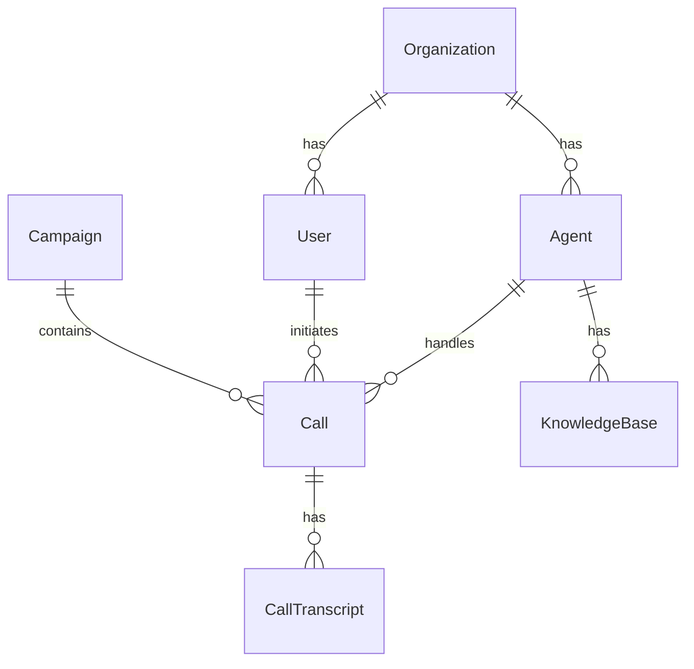
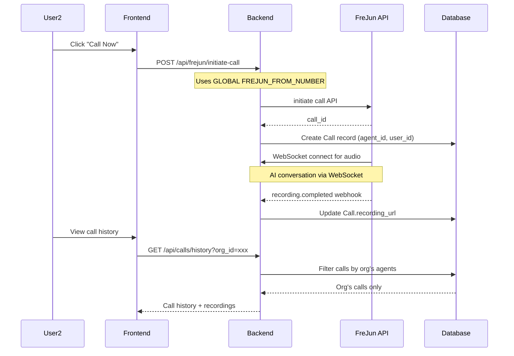

# Multi-Tenant Calling Architecture Analysis

## Overview

This document analyzes how the current system handles calling across different users, organizations, and agents. It covers FreJun phone number configuration, call routing, transcripts, recordings, and provides recommendations for multi-organization number support.

---

## Current Architecture

### Key Entities Relationship



---

## Current FreJun Number Configuration

> [!WARNING]
> **Currently, ALL calls use a SINGLE FreJun number** loaded from environment variables.

### How It Currently Works

| Component | Location | Current Behavior |
|-----------|----------|------------------|
| FreJun API Key | `FREJUN_API_KEY` env var | Single global key |
| From Number | `FREJUN_FROM_NUMBER` env var | Single number for ALL calls |
| Agent Phone Field | `Agent.phone_number` in DB | **NOT USED** for FreJun calls |

### Code Reference

```python
# In app/api/frejun.py (lines 33-34)
FREJUN_API_KEY = os.getenv("FREJUN_API_KEY", "")
FREJUN_FROM_NUMBER = os.getenv("FREJUN_FROM_NUMBER", "")
```

All outbound calls use this single `FREJUN_FROM_NUMBER` regardless of which user or agent initiates the call.

---

## Call Flow: Who Sees What?

### When Admin Makes a Call

1. Admin selects an agent (e.g., "Sales Agent")
2. Call is initiated via FreJun using global `FREJUN_FROM_NUMBER`
3. Call record created with:
   - `agent_id` = Sales Agent's ID
   - `user_id` = NULL (admin is not a regular user)
   - `from_number` = Global FreJun number
4. Call history: **Visible to Admin only** (no org filter)

### When User2 (Organization) Makes a Call

1. User2 logs in → `organization_id` attached to session
2. User2 selects their agent (filtered by organization)
3. Call is initiated via FreJun using **SAME global `FREJUN_FROM_NUMBER`**
4. Call record created with:
   - `agent_id` = User2's Agent ID (linked to org)
   - `user_id` = User2's ID
   - `from_number` = Global FreJun number
5. Call history: **Filtered by organization** (User2 only sees calls from their org's agents)

### Data Isolation Summary

| Data | Admin View | User2 View |
|------|------------|------------|
| Agents | All agents | Only organization's agents |
| Calls | All calls | Only calls from org's agents |
| Recordings | All recordings | Only org's call recordings |
| Transcripts | All transcripts | Only org's transcripts |

---

## How Transcripts & Recordings Work

### Transcripts

Transcripts are generated **in real-time** during the call:

1. **Source**: Audio is transcribed using Azure Speech-to-Text
2. **Storage**: Saved to `CallTranscript` table linked by `call_id`
3. **Access**: Retrieved via `/api/calls/history` with org filtering

```
Call (call_id) → CallTranscript (speaker: 'user'/'agent', message, timestamp)
```

### Recordings

Recordings are provided by **FreJun** after call ends:

1. **FreJun records** the call if `record: true` in API request
2. **Webhook** `/api/webhooks/frejun` receives `recording.completed` event
3. **Recording URL** saved to `Call.recording_url` field
4. **Access**: Frontend displays recording player if URL exists

```
FreJun → Webhook → Call.recording_url → Frontend Audio Player
```

---

## Connecting Agents to Different Numbers (CURRENT GAP)

> [!IMPORTANT]
> **The Agent.phone_number field exists but is NOT used for outbound FreJun calls.**

### Current Schema (Unused)

```python
# In app/db/models.py (Agent class)
phone_number = Column(String(20), unique=True, nullable=True)
```

This field was designed for **incoming call routing** (not yet implemented), not for selecting which number to call FROM.

---

## Required Changes for Multi-Org FreJun Numbers

### Option A: Per-Organization FreJun Configuration

Add FreJun credentials to Organization table:

```python
class Organization(Base):
    # ... existing fields ...
    frejun_api_key = Column(String(255), nullable=True)  # NEW
    frejun_from_number = Column(String(20), nullable=True)  # NEW
```

**Pros**: Each org has their own FreJun account and number  
**Cons**: Requires FreJun billing per organization

### Option B: Per-Agent FreJun Number

Use Agent.phone_number for outbound calls:

```python
# Modify frejun.py initiate_call
async def initiate_call(request, agent_id=None):
    if agent_id:
        agent = agent_service.get_agent(agent_id)
        from_number = agent.phone_number or FREJUN_FROM_NUMBER
    else:
        from_number = FREJUN_FROM_NUMBER
```

**Pros**: Flexible per-agent numbers  
**Cons**: All numbers must be on same FreJun account

---

## Implementation Steps for Multi-Org Numbers

### Phase 1: Database Changes

```sql
-- Add FreJun config to organizations table
ALTER TABLE organizations ADD COLUMN frejun_api_key VARCHAR(255);
ALTER TABLE organizations ADD COLUMN frejun_from_number VARCHAR(20);
```

### Phase 2: Backend Changes

1. **Modify `frejun.py`** - Accept `organization_id` parameter
2. **Load org-specific credentials** when initiating calls
3. **Fall back** to global env vars if org has no config

### Phase 3: Frontend Changes

1. **Organization Settings Page** - Allow adding FreJun credentials
2. **Encrypted Storage** - Store API keys securely

### Phase 4: Admin Setup Process

For each organization:
1. Admin logs into FreJun → Creates sub-account or gets number
2. Admin goes to org settings → Enters FreJun API Key + From Number
3. Org's calls now use their dedicated number

---

## Current Call Flow Diagram



---

## Summary: Current vs Needed

| Feature | Current State | Needed for Multi-Org |
|---------|---------------|---------------------|
| FreJun Number | Single global | Per-org or per-agent |
| API Key | Single global | Per-org (optional) |
| Call Tracking | ✅ By agent/user | ✅ Already works |
| Transcripts | ✅ Linked to call | ✅ Already works |
| Recordings | ✅ Linked to call | ✅ Already works |
| Call History Filter | ✅ By organization | ✅ Already works |
| Billing Isolation | ❌ Single account | Per-org accounts |

---

## Next Steps

1. **Decide**: Per-Org or Per-Agent number approach?
2. **FreJun Setup**: Check if FreJun supports sub-accounts
3. **Database Migration**: Add org-level FreJun fields
4. **Backend Update**: Load org-specific FreJun credentials
5. **Admin UI**: Settings page for org FreJun configuration
